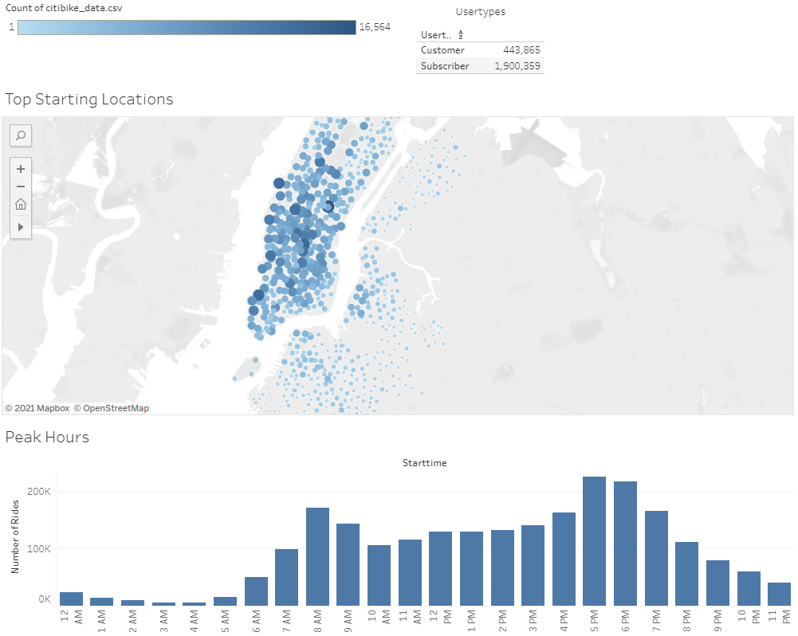
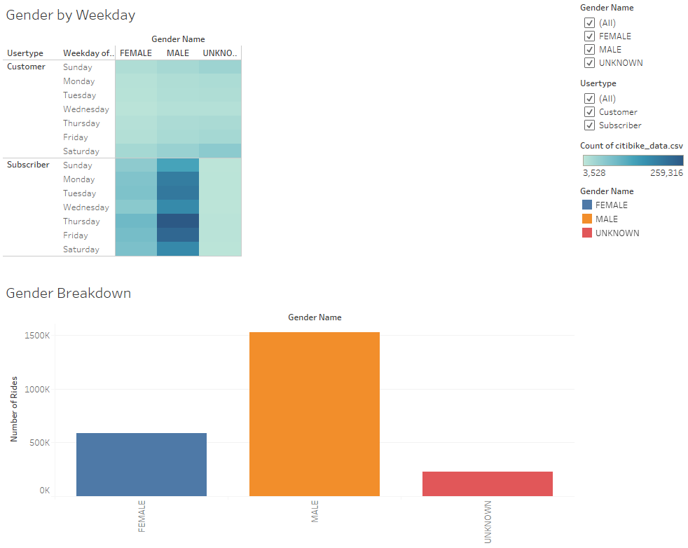
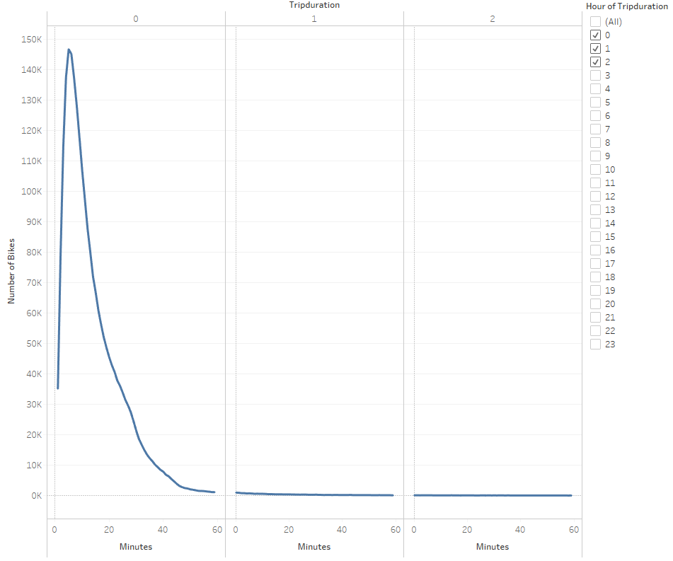
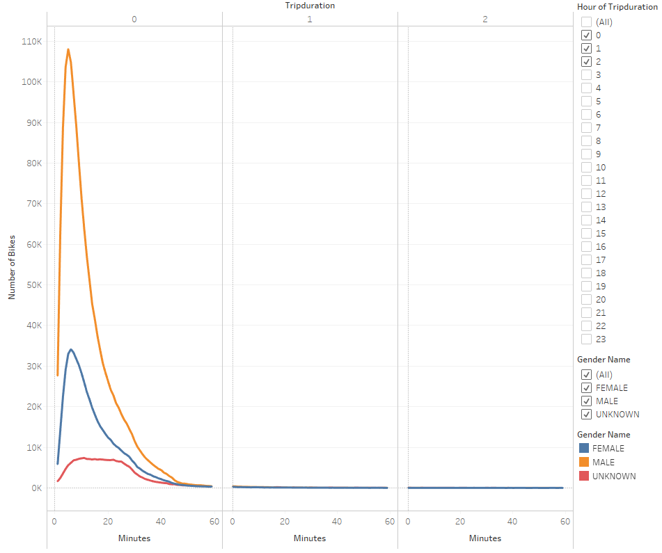
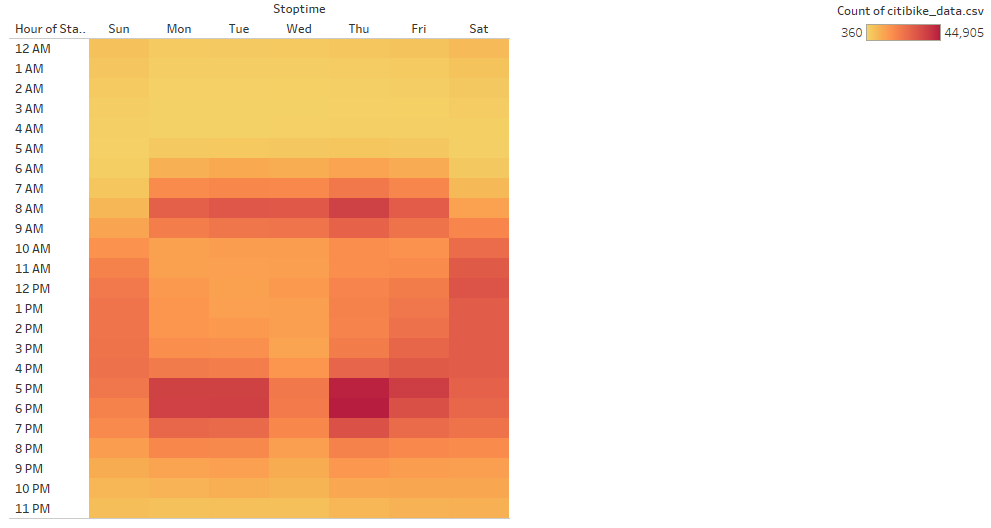
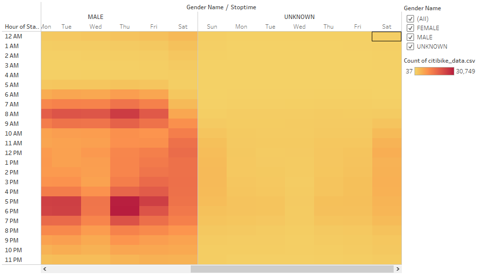
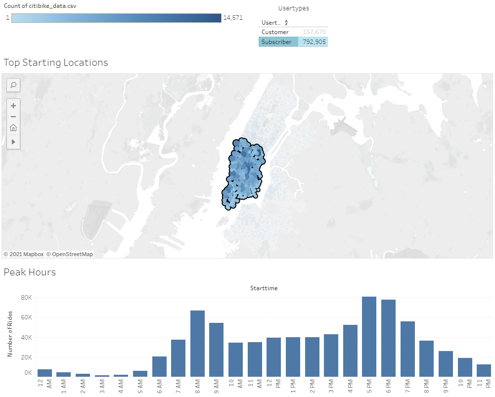
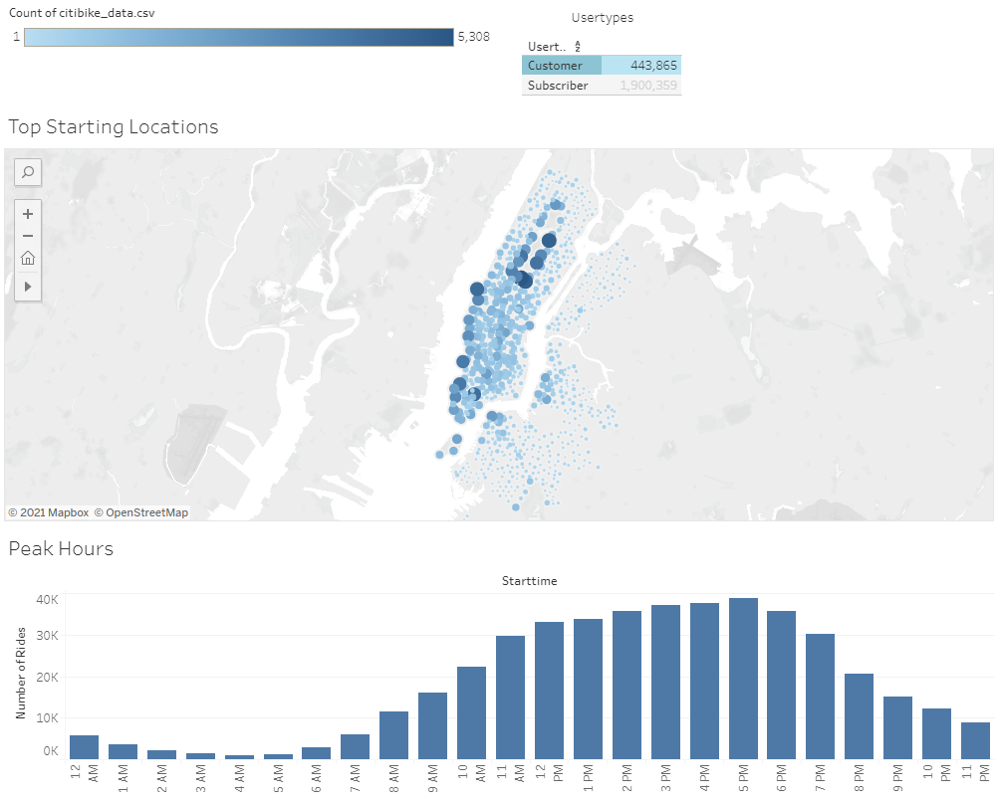
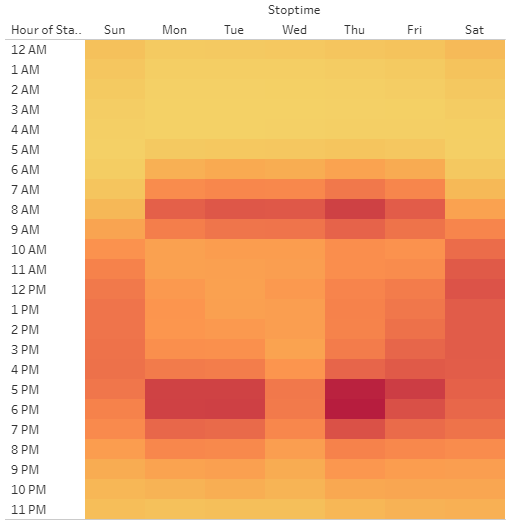

# bikesharing

[City Bike Tableau Dashboard](https://public.tableau.com/profile/josh.pearson8858#!/vizhome/CitibikeChallenge_16161587957450/Story1?publish=yes "Link to Tableau Dashboard")

## Project Overview

On a trip to NYC we used Citi Bikes to get around the city. This method of transportation allowed us to get to know the city and interact with the people who live there and who are using bikes for their commutes.  

After the tip and idea starts to form - start a similar bike share business in our hometown of Des Moines Iowa. We gain the attention of a potential angel investor who may be interested in providing seed funding to explore bringing a bike-share program right here to Des Moines.

Using publically available Citi Bike data we want to analyze how the bike-share business actually works in New York City. From there we'll create a proposal on how it might work in Des Moines. 

## Results 

### The top starting locations and peak hours for Citi Bike rentals. 

 
We can clearly see from this image that the vast majority of City Bike checkouts occur in Manhattan south of Central Park. The most common checkout hours are in the mornings 8am-10am and in the afternoons from 4pm-8pm. Over 80% of checkouts where made by users with subscriptions. Subscibers are like residents or frequent visitors of the city whereas customers are likely short term visitors. 
 

### The volume breakdown by user type and weekday separated by gender. 

 
65% of all checkouts where made by men, 25% were made by women and for 10% of checkouts the gender of the rider is unknown. Subscibers are more likely to use the bikes during the week, likely for their commute, than on the weekend. Customers are much more likely to use the bikes on weekends while they are visiting and seeing the sites. Customers are much less likely to share their gender information. 
 

### The volume of rentals by length of checkout time.

 
The most common use case is for quick trips covering short distances. The vast majority of checkout durations last 30 minutes or less. 5 minutes is the mode value with nearly 150K observations. 
 

### The volume of rentals by length of checkout time separated by gender.

 
Similar story when we add the gender breakout to the previous graphic. The biggest delta is within the unknown gender group. Their mode trip duration is 11 minutes. As we have stated previously the majority of unkown genders come from customers not from subscribers. 
 

### Heatmap of trip start hour for each day of the week. 

 
We observed earlier that he most common ride hours are in the mornings 8am-10am and in the afternoons from 4pm-8pm. Although this is still the case we see it is only true on weekdays; weekend rides are spread more evenly between the afternoon hours. 
 

### Heatmap of trip start hour for each day of the week separated by gender.

 
When we split the previous heatmap view by gender we see that Female and Male users follow a similar distribuion whereas unknow genders, mostly short term customers, ride mainly on weekends. 
 

## Summary

### Male and Female riders behave similarly. 
Although there are over twice as many male riders they behave in very similar ways. 
 

### Subscribers use Citi Bikes in their commutes. 

 

When we look subscriber checkouts in the business districts south of central park we see the morning and evening commute utalization spikes are evem more pronounced than before. 
 

### Customers use Citi Bikes for afternoon and late morning sightseeing.

 
When we look customer see a relatively even distribution throughout the afternoon hours. 
 

### Additional analysis needed to make a confident presentation to our investors. 
-  In this heatmap we see that the Wednesday afternoon commute hours see much less usage than the other weekdays. This is likely because of a weather event on one or multiple Wednesdays from our month of data.  We suggest additional months of data to be more confident in our data. We should repeat the analysis that is in our current dashboard once the additional data has been loaded and summarized. 

- Add a layer to our map that shows additional transportation options in NYC. Is there a spike in usage for stations that are further away from subway stations and bus routes? 

- How do special events such as concerts, and sporting events impact utilization in the areas nearest the event? 

- How does weather impact utilizaion and how does NYC's weather compare to that of Des Moines?

